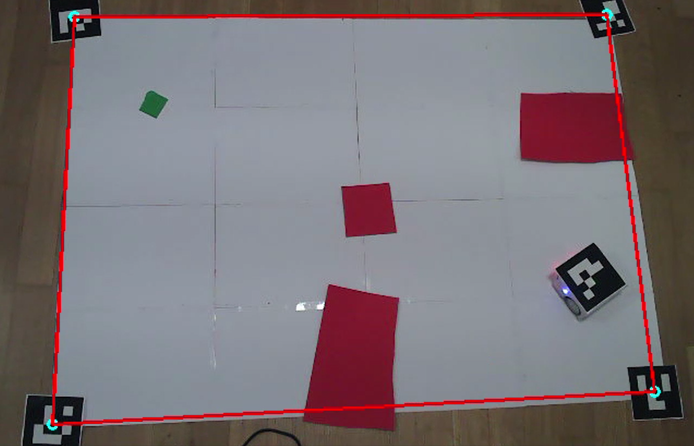
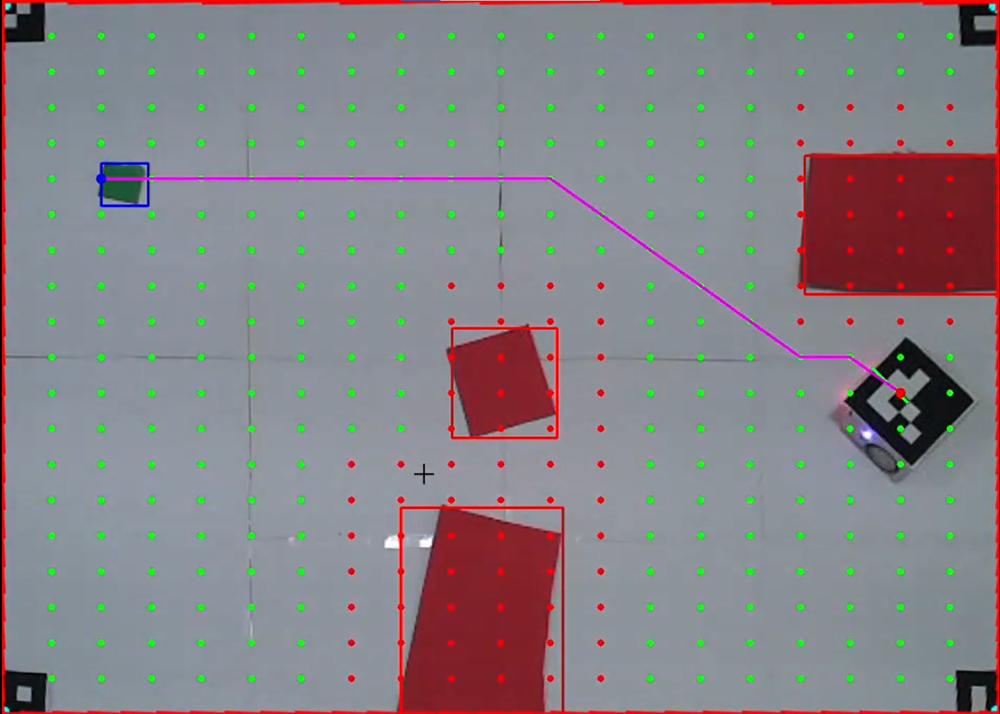
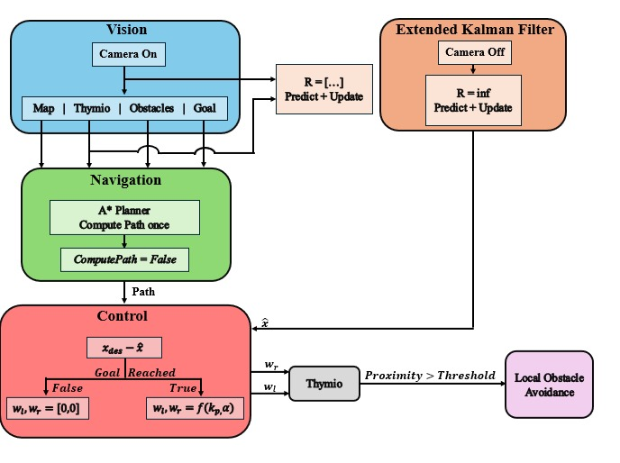

# Basics-of-mobile-robotics
This projects revolves around building an environment for a Thymio Robot to be able to navigate autonomously to a goal while planning a path, avoiding both global and local obstacles

# Basics of Mobile Robotics Project - Group 21 

## Table of Contents:
1. Introduction
2. Vision Module
3. Global Navigation
4. Kalman Filter
5. Local Navigation and Motion Control
6. Local Obstacle Avoidance
7. Main

## Introduction
This project focuses on implementing and integrating different modules necessary for mobile robotics navigation. The system includes vision-based localization, global and local navigation, and sensor fusion using a Kalman filter.

## Vision Module and Global navigation
The vision module is responsible for detecting ArUco markers and estimating the robot's position. OpenCV is used for marker detection, and camera calibration is performed to obtain accurate pose estimation. A global path planner is implemented to guide the robot towards its goal while avoiding known obstacles. The planner considers map constraints and dynamically updates paths as needed.



## Kalman Filter
A Kalman Filter is applied for state estimation, fusing sensor data to improve localization accuracy and filter out noise from sensor readings.

## Local Navigation and Motion Control
The local navigation system generates smooth control commands for the robot, ensuring stable motion and adapting to real-time environmental changes.

## Local Obstacle Avoidance
This module is responsible for detecting and avoiding obstacles that are not included in the global map. Sensor data is processed to generate alternative paths when obstacles are encountered.

## Main
The main script integrates all modules into a working system, ensuring seamless operation between vision, navigation, and control components.



## Installation & Dependencies
To run this project, install the necessary dependencies:

```bash
pip install numpy matplotlib tdmclient opencv-python

